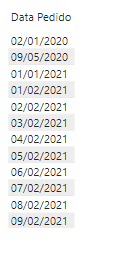
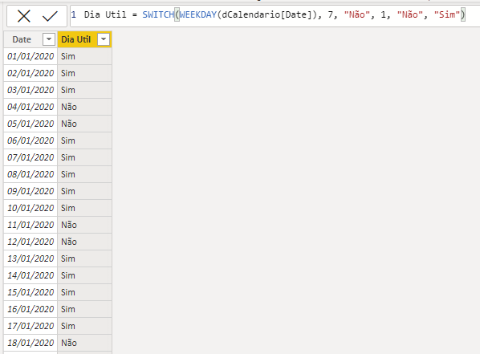
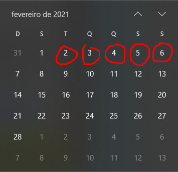
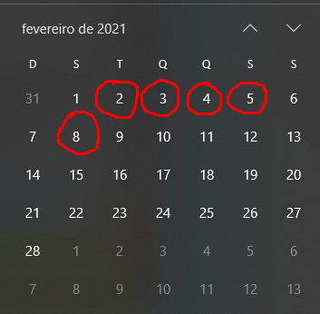
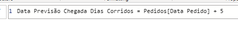
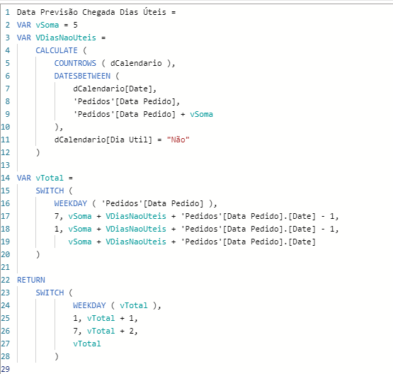
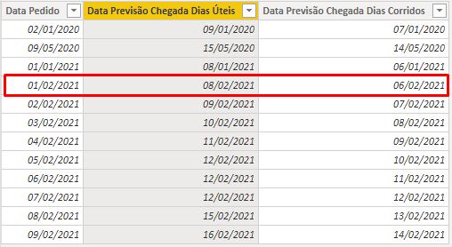

# PBI-Somando-Dias-Uteis

Venho com mais um post, e dessa vez o objetivo é realizar a soma de dias úteis no Power BI utilizando DAX.  

Inicialmente, possuímos uma tabela com Datas de Pedido, no qual o objetivo é realizar uma soma para saber qual é a Data de Chegada desses pedidos, considerando o valor de 5 dias úteis. 

Tendo com base essas datas, o primeiro passo é criar uma tabela dCalendario e verificar os dias úteis e não úteis. Para este exemplo eu não me preocupei com os feriados, mas, caso você queira implementar algum cálculo considerando além de sábado e domingo os feriados, confira a minha postagem com a solucutação das diferenças de datas considerando também só dias úteis clicando aqui: https://github.com/AfonsoFeliciano/PBI-Diferenca-Dias-Uteis  

Então de maneira mais simples, para saber se o dia é útil ou não, basta verificar o seu número utilizando a função <a href="https://docs.microsoft.com/pt-br/dax/weekday-function-dax">WEEKDAY</a> . Essa função retorna o número do dia da semana de uma data. E se ele for igual 1 ou 7, significa que ele não é um dia útil, do contrário ele é um dia útil.  

Após isso, vamos analisar a data 01/02/2021 e somar 5 corridos e úteis a ela. 

Conforme imagem acima, somando 5 dias corridos a essa data, temos a data de 06/02/2021 no qual cai em um sábado. E agora, vamos ao exemplo dos dias úteis. 

Ao somar 5 dias úteis a essa data, a data seria 08/02/2021. Feito isso, já temos uma referência no qual podemos validar alguns cálculos.   

No DAX, vamos calcular primeiro os dias corridos. Esse cálculo é bem simples, visto que só precisamos pegar a coluna de Data desejada e somar com o número que gostaríamos de calcular. 

Agora que somamos os dias corridos, vamos realizar a soma dos dias úteis. Segue abaixo a minha solução e posteriormente o comentário do que foi implementado. 

Basicamente, eu sinto mais facilidade utilizando variáveis. Neste exemplo criei uma variável vSoma para armazenar a quantidade dias que eu preciso somar.  

Feito isso, criei uma variável vDiasNaoUteis que armazena a quantidade de dias não úteis que possuo entre a Data do Pedido e a Data do Pedido + 5 dias corridos.   

Até este trecho do código o que acontece é o seguinte: Conte na dCalendário os dias que a coluna Dia Util é igual a Não e a Data da dCalendário está entre 01/02/2021 e 06/02/2021. E o resultado é exatamente 1 dia não útil.  

Sabendo disso, podemos partir para o próximo trecho do código que se inicia na variável vTotal. O objetivo dessa variável é armazenar a soma da variável vSoma (neste caso 5 dias) + a quantidade de dias não úteis armazenada na variável VDiasNaoUteis (para este exemplo o valor foi de 1 dia) + a Data de Pedido (se a Data do Pedido não for sábado ou domingo) ou Data do Pedido - 1 (se a Data do Pedido for sábado ou domingo).   

Em resumo, o que aconteceu neste momento foi: 01/02/2021 + 5 dias corridos + 1 dia não útil, retornando então o valor 07/02/2021.   

Para finalizar, chegamos então no bloco Return, no qual verifica se a variável vTotal (soma dos valores mencionados acima) é Domingo, então soma mais 1 dia. Se é sábado, então soma mais 2 dias. Se é um dia da semana então não soma nada. Ou seja, neste caso como o nosso retorno foi 07/02/2021 e essa data caiu em um domingo, o correto é somarmos mais 1 dia útil, para que então caia na segunda.  

O resultado final, pode ser visto abaixo: 

Ressalto que esse foi apenas um modo, porém, ao implementar os feriados, as regras complicam mais um pouco. Desafio você a aplicar as regras com feriados, e se ficou com alguma dúvida, tem sugestões de novos conteúdos, bora bater um papo no  =) 

